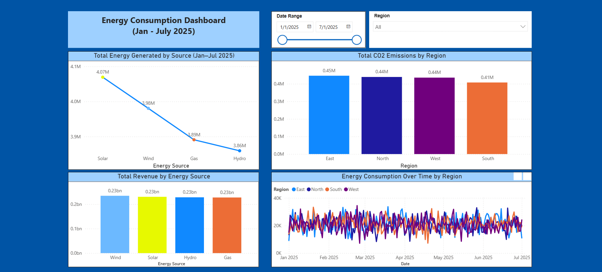

# ⚡ Energy Comsumption Dashboard

Welcome to the Energy Consumption Dashboard—a Power BI project inspired by the growing need for smarter energy insights in a world focused on sustainability and efficiency.
This dashboard explores key performance metrics for an energy company across four regions, providing visibility into energy generation, consumption trends, revenue performance, and CO₂ emissions. By leveraging interactive visuals, filters, and data-driven storytelling, this project demonstrates how Power BI can transform complex energy data into actionable insights.
Whether you're an energy analyst, a sustainability advocate, or a data visualization enthusiast, this dashboard offers a clear and engaging overview of how data can support better energy decisions.

## 📊 Features

This Power BI dashboard includes four core visualizations designed to support strategic decision-making in the energy sector:

-	**Energy Generation by Source**
Visualizes total energy production by source (Solar, Wind, Gas, Hydro), highlighting renewable contributions and enabling energy mix analysis.
- **Consumption Trends by Region**
Tracks daily energy consumption across four geographic regions, helping identify seasonal demand patterns and regional load behaviors.
- **Revenue Analysis by Source**
Displays revenue performance by energy type, revealing key financial drivers and supporting pricing and investment strategies.
- **CO₂ Emissions by Region**
Monitors emissions from non-renewable sources (e.g., Gas), offering insights for sustainability planning and ESG reporting.

##🔧 Interactive Capabilities
- **Slicers** for Region and Date Range allow customized views
- **Drill-through filters** enable deeper regional performance analysis

## 🔧 Tools & Technologies

- **Power BI** – Data modeling, transformation (Power Query), and visualization
- **Excel** – Source file for observational data
- **GitHub** – Version control and project documentation

## 🧠 Use Cases
1.	Strategic Energy Planning
2.	Load Forecasting & Demand Management
3.	Revenue & Pricing Analysis
4.	ESG & Sustainability Reporting
5.	Operational Reporting
6.	Stakeholder Transparency

## 📷 Screenshots

## 📁 Files Included
- `Energy Company Dashboard.pbix`: Main Power BI project file
- `Sample_Energy_Company_PBI.xlsx`: Sample dataset
- `screenshots/`: Visual previews of the report

## 🗂️ Project Status

✅ Complete – Ready for demonstration and portfolio inclusion  

## 📫 Contact
Catherine McKillips

[LinkedIn](https://www.linkedin.com/in/catherine-mckillips-data-analytics)  

## 📧 Email
cathymckillips@gmail.com

